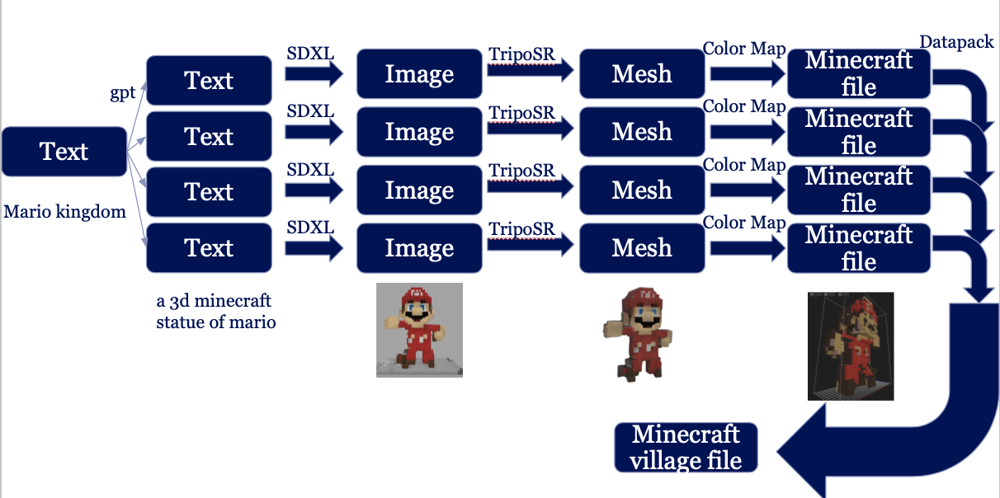

# PiCraft
If you have any questions regarding PiCraft feel free to join the discord server of PiCraft
https://discord.gg/GDMZSDUxMx

PiCraft is a tool that generates Minecraft structures by converting text into an image, image into an object, and the object into a Minecraft nbt file.
The nbt files are placed in a datapack, therefore the dapack can be easily imported into Minecraft. 
The figure below shows the pipeline of the tool.

  

## Structure
images: the images used for the Readme
README.md: the text your reading now.
Thesis.pdf: an eleborate explanation of StableDiffusion and what was created in the project.

dataset
  - requirements.txt: A file with the python import requirements for creating the dataset
  - converter.py: the code used to generate images
  - push.py: A file to upload the generated images to huggingface
  - palate.txt: the color mappings as used to generate 3 datasets
  - schem: the location of your provided schematic files.
  - obj: the location for the generated obj files
  - image: the location of all the generated images
bot
  - requirements.txt: A file with the python import requirements
  - config.sh: A file with the exports required to set the environment to run the tool.
  - bot.py: the code that handles users request to transform text into a minecraft structure
  - response.py: the code that calls api's from chatGPT, Replicate and other websites that provide GPU's to generate the object belonging to each house.
  - converter1.py: the conversion back from object into Minecraft House1 structure
  - converter2.py: the conversion back from object into Minecraft House2 structure
  - converter3.py: the conversion back from object into Minecraft House3 structure
  - converter4.py: the conversion back from object into Minecraft House4 structure
  - palate.txt: the color mappings as used to generate 3 datasets back into structures
  - Pack: the place for your generated intermediate image, obj and nbt files.
  - Japanese: ... This is the Datapack where the nbt structures are automatically replaced. This datapack was originally made available here: https://www.planetminecraft.com/data-pack/japanese-cherry-village-1-20-4/

## Huggingface
Each of the datasets is published on huggingface below the links to the models on huggingface.

## Replicate
Below the model as published on Replicate
